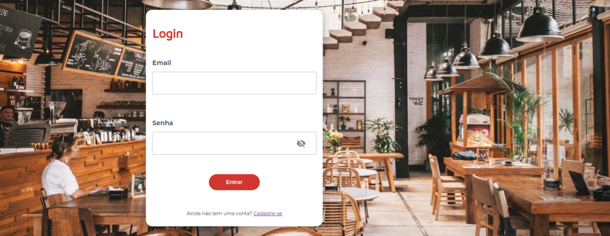
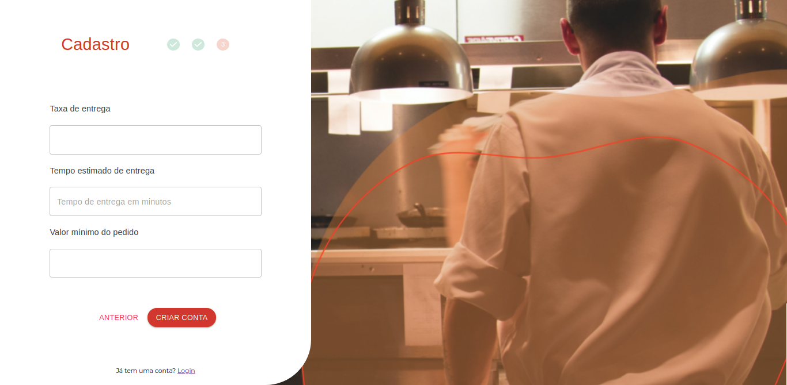
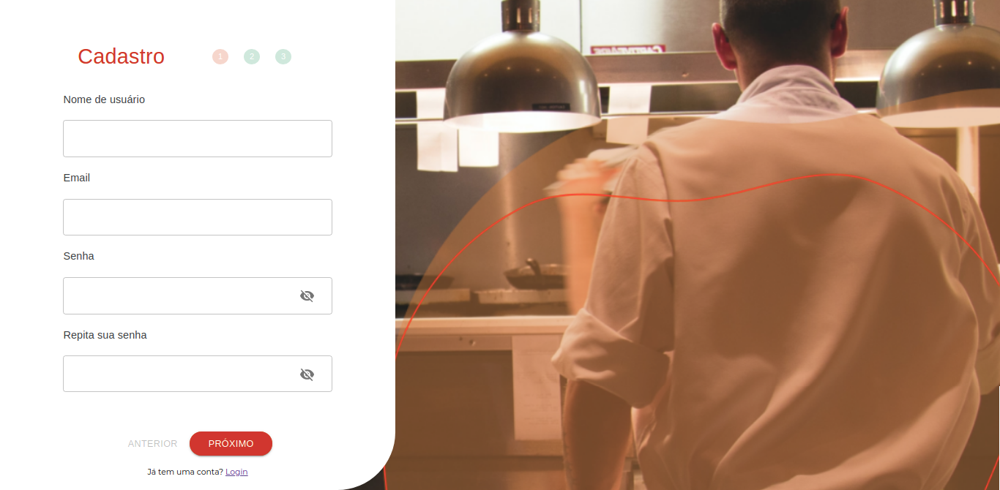
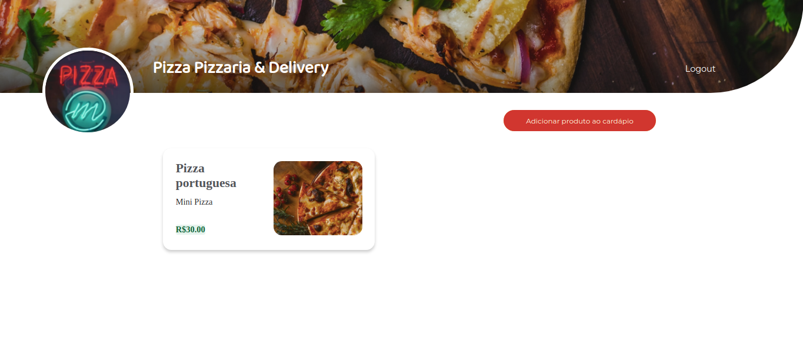
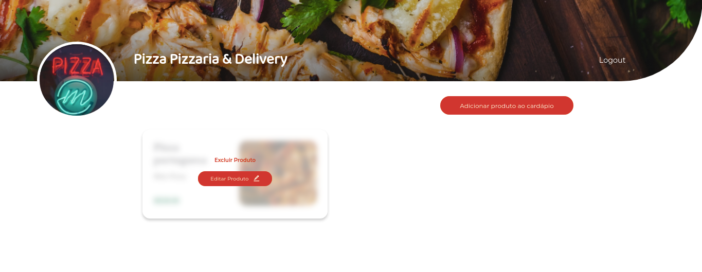
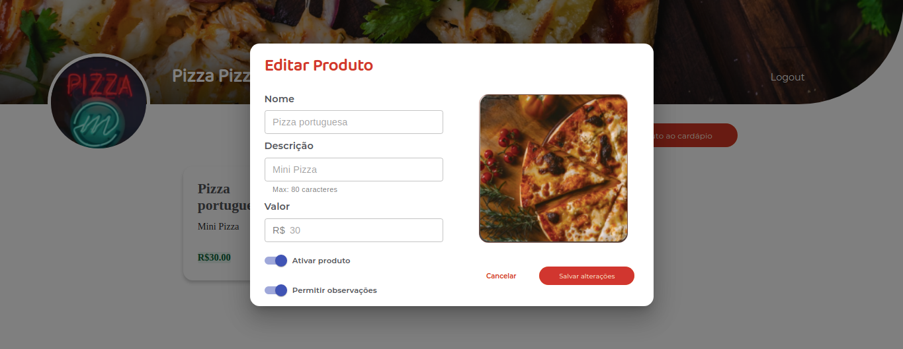
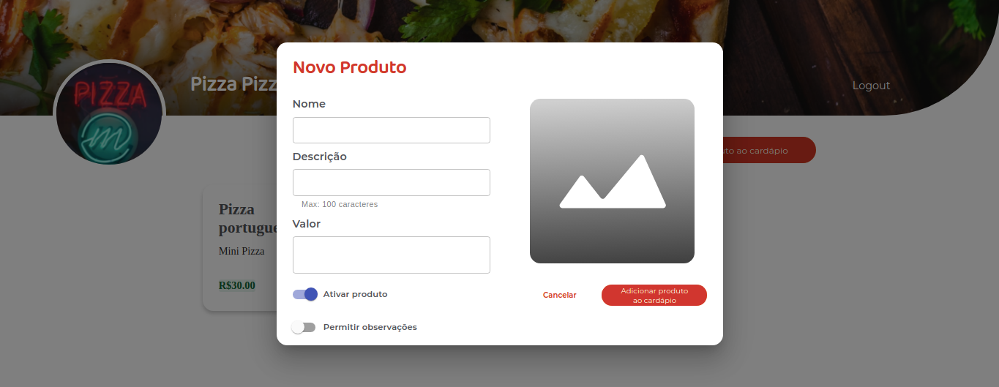

# Desafio final - Cubos Academy - ICubos

Proposta é criar uma plataforma para restaurantes venderem seus produtos

## Repositórios das aplicações:

01 - **APLICAÇÃO CLIENTE** [RESTAURANTE - FRONT-END](https://github.com/luisa-spl/desafio-modulo-05-frontend)
02 - **API CLIENTE** [RESTAURANTE - BACK-END](https://github.com/DevVane/desafio-modulo-05-backend)
03 - **API CLIENTE** [RESTAURANTE - BACK-END - DEPLOY](https://icubus.herokuapp.com)
04 - **APLICAÇÃO CLIENTE** [CONSUMIDOR- FRONT-END](https://github.com/cboscariol/desafio-modulo-05-frontend)
05 - **API CLIENTE** [CONSUMIDOR - BACK-END](https://github.com/DevVane/desafio-modulo-05-backend-icubus-cliente)
06 - **API CLIENTE** [CONSUMIDOR - BACK-END - DEPLOY](https://icubus-clientes.herokuapp.com)

### Rodando o projeto

Na pasta raiz do projeto, você pode rodar:

#### `npm start`

Uma aba será aberta localmente no seu browser (http://localhost:3000) para rodar as duas ao mesmo tempo, rode em duas portas distintas (http://localhost:3001)

Prévia da aplicação:

## Login:

## Cadastro:

